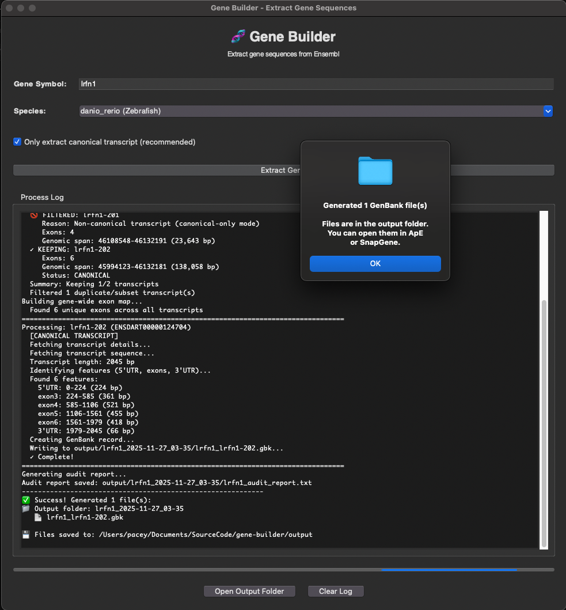
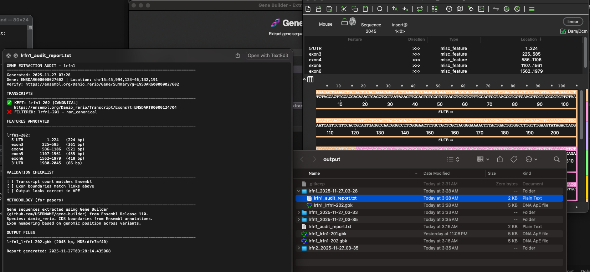

# 🧬 Gene Builder

**Extract zebrafish gene sequences from Ensembl and generate APE-compatible files and audit reports.**



---

## 🚀 Quick Start

### 1. Setup (One-time)
Open Terminal and run:

```bash
git clone https://github.com/ScienceIsNeato/gene-builder.git
cd gene-builder
./setup.sh
```

### 2. Run
Double-click **`extract_gene.command`**

### 3. Extract & Verify
1.  Enter a gene symbol (e.g., `lrfn1`).
2.  Click **Extract Gene**.
3.  Open the output folder to see your `.gbk` files and Audit Report.

---

## Output Examples

### GenBank Files (APE/SnapGene)

Color-coded exons, correct UTRs, and metadata.

### Audit Reports (Text)
Documents filter results, decision points, and provides direct Ensembl links for verification.

```text
GENE: lrfn1
✅ KEPT: lrfn1-202 [CANONICAL]
   Link: https://ensembl.org/...
❌ FILTERED: lrfn1-201 - non-canonical

SANITY CHECKS
1. Click: [Ensembl gene link]
   Confirm gene location matches
2. For transcript lrfn1-202:
   Click: [Ensembl transcript link]
   Verify exon boundaries match
```

---

## Customizing

All settings are in one file: **`config.py`**.

*   Change exon colors
*   Set default species
*   Adjust filtering

---

## Documentation

*   `TROUBLESHOOTING.md` - Common issues and solutions
*   `DOCS/USER_GUIDE.md` - Detailed usage instructions
*   `DOCS/AUDIT_REPORTS.md` - Understanding audit report contents
*   `DOCS/AGENTS.md` - Share with AI to help modify the tool
*   `DOCS/DEVELOPMENT.md` - Technical reference for developers

## Requirements
*   macOS 10.15 (Catalina) or later (Intel or Apple Silicon)
*   Internet Connection
